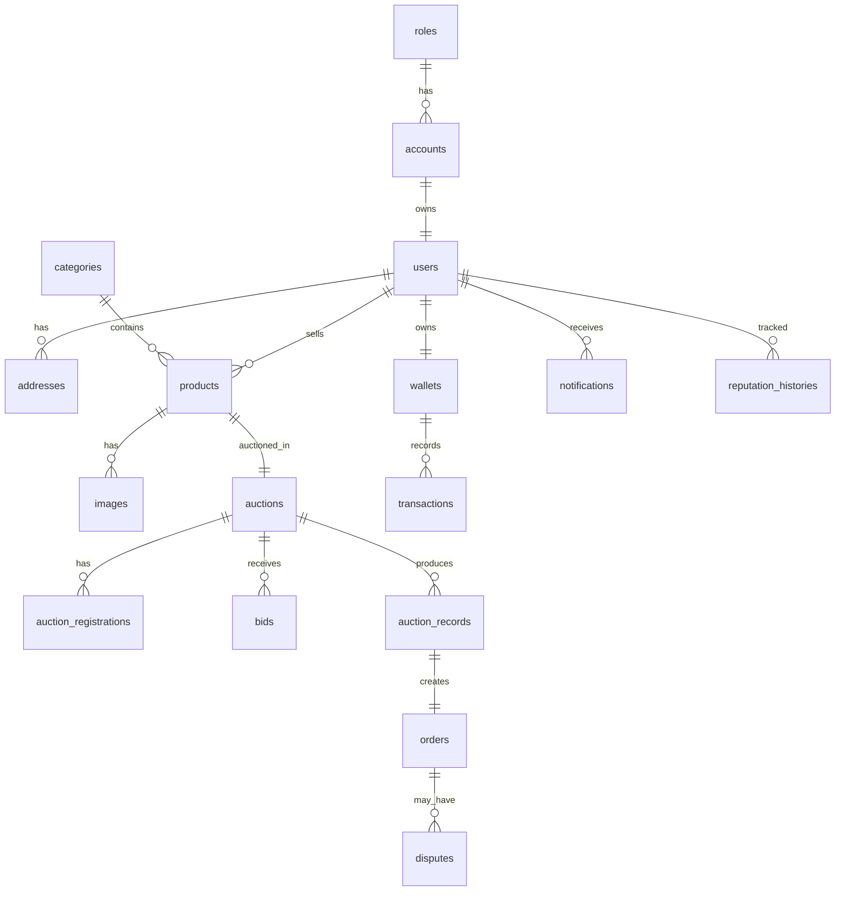

# 🏷️ Auction Platform — Nền tảng Đấu giá Trực tuyến

> **Ứng dụng web full-stack cho phép người dùng đăng bán sản phẩm, tạo phiên đấu giá, đặt giá (bid) theo thời gian thực, và quản lý toàn bộ vòng đời giao dịch từ đặt cọc, thanh toán đến nhận hàng.**

---

## 📸 Demo / Screenshots

<!-- Thêm ảnh chụp màn hình hoặc GIF demo tại đây -->

| Trang chủ | Chi tiết đấu giá | Tạo phiên đấu giá |
|:---------:|:----------------:|:-----------------:|
|  |  |  |

| Đăng nhập | Hồ sơ & eKYC | Thanh toán |
|:---------:|:-------------:|:----------:|
|  |  |  |

> 💡 *Thay thế các ảnh trên bằng screenshot thực tế của dự án, hoặc cung cấp link video demo.*

---

## 🛠️ Công nghệ (Tech Stack)

### Backend

| Công nghệ | Phiên bản | Mục đích |
|-----------|:---------:|----------|
| **Java** | 21 | Ngôn ngữ chính |
| **Spring Boot** | 4.0.6 | Framework chủ lực |
| **Spring Security + OAuth2** | — | Xác thực & phân quyền (JWT, Google, Facebook) |
| **Spring Data JPA** | — | ORM, tương tác cơ sở dữ liệu |
| **Spring WebSocket** | — | Giao tiếp real-time (đấu giá, thông báo) |
| **PostgreSQL** | — | Cơ sở dữ liệu quan hệ |
| **Redis** | — | Caching & Blacklist Token |
| **Cloudinary** | 1.36.0 | Upload & quản lý ảnh sản phẩm |
| **FPT.AI Vision** | — | OCR nhận diện CCCD (eKYC) |
| **MapStruct** | 1.5.5 | Mapping DTO ↔ Entity |
| **Lombok** | — | Giảm boilerplate code |
| **Nimbus JOSE+JWT** | 9.40 | Tạo & xác minh JWT token |
| **SpringDoc OpenAPI** | 3.0.3 | Swagger API Documentation |

### Frontend

| Công nghệ | Phiên bản | Mục đích |
|-----------|:---------:|----------|
| **React** | 18.2 | Thư viện UI chính |
| **Vite** | 4.4.5 | Build tool nhanh |
| **React Router** | 6.22.3 | Điều hướng SPA |
| **Zustand** | 5.0.14 | State management gọn nhẹ |
| **Axios** | 1.6.8 | HTTP Client |
| **TailwindCSS** | 3.3.2 | Utility-first CSS framework |
| **GSAP** | 3.15.0 | Animation mượt mà |
| **Lucide React** | 0.363.0 | Icon library |
| **Zod** | 4.4.3 | Schema validation |
| **Firebase** | 12.12.1 | Google OAuth (phía client) |

### DevOps & Triển khai

| Công nghệ | Mục đích |
|-----------|----------|
| **Docker** | Container hóa Frontend |
| **Maven** | Build & quản lý dependency Backend |
| **Git & GitHub** | Version control |

---

## ✨ Điểm nổi bật (Features)

### 🔐 Xác thực & Bảo mật
- **Đăng nhập/Đăng ký** bằng tài khoản cục bộ (username/password)
- **OAuth2 Social Login** — Đăng nhập nhanh bằng Google & Facebook
- **JWT Access Token + Refresh Token** — Phiên đăng nhập an toàn, tự động làm mới
- **Token Blacklist (Redis)** — Đăng xuất tức thì, vô hiệu hóa token cũ
- **Phân quyền Role-Based** — ADMIN, STAFF, USER với các endpoint bảo vệ riêng

### 🪪 eKYC — Xác minh danh tính
- **Tích hợp FPT.AI Vision OCR** — Tự động nhận diện thông tin từ ảnh CCCD (Căn cước công dân)
- Trích xuất: Số CCCD, họ tên, giới tính
- Upload ảnh CCCD lên **Cloudinary** ở chế độ `authenticated` (bảo mật)
- Cập nhật trạng thái xác minh: `UNVERIFIED` → `VERIFIED`

### 🏷️ Quản lý Phiên Đấu giá
- **Tạo phiên đấu giá** với đầy đủ thông tin: sản phẩm, danh mục, ảnh, giá khởi điểm, bước giá, tiền cọc, thời gian
- **Upload nhiều ảnh** sản phẩm lên Cloudinary (ảnh đầu tiên tự động làm ảnh bìa)
- **Trạng thái phiên đấu giá** đầy đủ vòng đời: `PENDING` → `APPROVED` → `ACTIVE` → `EXTENDED` → `CLOSED`
- **Gia hạn tự động** khi có bid vào phút cuối (anti-snipe)
- **Duyệt danh sách** đấu giá với bộ lọc và tìm kiếm

### 💰 Đấu giá Real-time
- **Đặt giá (Bid)** theo thời gian thực qua WebSocket
- **Lịch sử Bid** đầy đủ cho từng phiên
- **Đăng ký tham gia** phiên đấu giá kèm đặt cọc
- **Xếp hạng người thắng** — Người thắng chính + người dự phòng (backup)

### 💳 Ví điện tử & Thanh toán
- **Hệ thống Ví (Wallet)** — Số dư khả dụng + số dư đóng băng
- **Tích hợp cổng thanh toán** MoMo & VNPay
- **Nạp tiền** vào ví qua MoMo
- **Các loại giao dịch** đa dạng: Nạp/Rút, Cọc đấu giá, Hoàn cọc, Thanh toán, Phí nền tảng, Phí hủy

### 📦 Đơn hàng & Giao dịch sau Đấu giá
- **Tạo đơn hàng** tự động sau khi đấu giá kết thúc
- **Vòng đời đơn hàng**: Chờ thanh toán → Đã thanh toán → Hẹn gặp → Hoàn thành
- **Hẹn gặp trực tiếp** (meeting) giữa người mua và người bán
- **Đánh giá & Nhận xét** sau giao dịch

### ⚖️ Khiếu nại & Uy tín
- **Hệ thống khiếu nại (Dispute)** — Người mua/bán có thể tạo khiếu nại với bằng chứng
- **Admin xử lý** khiếu nại và đưa ra phán quyết
- **Điểm uy tín (Reputation Score)** — Theo dõi lịch sử tăng/giảm uy tín dựa trên hành vi

### 🔔 Hệ thống Thông báo
- **Thông báo real-time** qua WebSocket
- Các loại: Bid mới, Thắng đấu giá, Hoàn cọc, Đơn hàng, Khiếu nại...
- Đánh dấu đã đọc / chưa đọc

---

## 📂 Cấu trúc dự án

```
Auction/
├── Backend/                          # Spring Boot API Server
│   ├── src/main/java/.../
│   │   ├── config/                   # Cấu hình (Security, Redis, Swagger, Cloudinary, CORS)
│   │   ├── controller/               # REST API Controllers
│   │   │   ├── AuthenticationController.java
│   │   │   ├── AuctionController.java
│   │   │   ├── EKycController.java
│   │   │   └── UserController.java
│   │   ├── dto/                      # Data Transfer Objects (Request/Response)
│   │   ├── entity/                   # JPA Entities (17 bảng)
│   │   │   ├── Account, User, Role
│   │   │   ├── Product, Category, Image
│   │   │   ├── Auction, Bid, AuctionRecord, AuctionRegistration
│   │   │   ├── Wallet, Transaction
│   │   │   ├── Order, Dispute
│   │   │   ├── Notification, ReputationHistory
│   │   │   └── enums/                # Enum types (15+ trạng thái)
│   │   ├── exception/                # Custom Exception & Error Code
│   │   ├── mapper/                   # MapStruct Mappers
│   │   ├── repository/               # JPA Repositories
│   │   ├── service/                  # Business Logic
│   │   └── utils/                    # Tiện ích (SecurityUtils...)
│   ├── database.sql                  # Script khởi tạo CSDL PostgreSQL
│   ├── pom.xml                       # Maven dependencies
│   └── application.yaml             # Cấu hình ứng dụng
│
├── Frontend/                         # React SPA (Vite)
│   ├── src/
│   │   ├── components/               # UI Components tái sử dụng
│   │   │   ├── Auction/              #   └── AuctionCard
│   │   │   └── Elements/             #   └── Modal, Toast, Skeleton, Confetti, EmptyState
│   │   ├── config/                   # Cấu hình (Firebase, etc.)
│   │   ├── features/                 # Feature modules (API calls)
│   │   │   ├── auction/api.js        #   └── CRUD Auction, Bid, Category
│   │   │   ├── auth/api.js           #   └── Login, Register, Profile, Notification
│   │   │   └── payment/api.js        #   └── MoMo, VNPay, Wallet
│   │   ├── hooks/                    # Custom React Hooks
│   │   ├── layouts/                  # MainLayout, AuthLayout
│   │   ├── pages/                    # Trang chính
│   │   │   ├── public/               #   └── Home, AuctionList, AuctionDetail
│   │   │   ├── auth/                 #   └── Login, Register
│   │   │   ├── bidder/               #   └── Profile, EKyc, Checkout, PaymentResult
│   │   │   ├── seller/               #   └── CreateAuction
│   │   │   └── admin/                #   └── (Admin Dashboard — đang phát triển)
│   │   ├── routes/                   # AppRoutes, ProtectedRoute
│   │   ├── schemas/                  # Zod validation schemas
│   │   ├── services/                 # Axios API Client
│   │   ├── store/                    # Zustand stores (useAuthStore)
│   │   └── utils/                    # Helper functions
│   ├── package.json
│   ├── tailwind.config.js
│   ├── vite.config.js
│   └── Dockerfile
│
└── README.md
```

---

## 🗄️ Sơ đồ CSDL (Database Schema)

Hệ thống sử dụng **PostgreSQL** với **17 bảng** chính, được chia theo module:



| Module | Bảng | Mô tả |
|--------|------|-------|
| **Phân quyền** | `roles`, `accounts` | Quản lý tài khoản & vai trò (ADMIN, STAFF, USER) |
| **Người dùng** | `users`, `addresses` | Thông tin cá nhân, địa chỉ, xác minh KYC |
| **Sản phẩm** | `categories`, `products`, `images` | Danh mục, sản phẩm đấu giá, ảnh minh họa |
| **Đấu giá** | `auctions`, `auction_registrations`, `bids`, `auction_records` | Phiên đấu giá, đăng ký, đặt giá, kết quả |
| **Tài chính** | `wallets`, `transactions` | Ví điện tử, lịch sử giao dịch |
| **Đơn hàng** | `orders`, `disputes` | Quản lý đơn hàng & khiếu nại |
| **Uy tín** | `reputation_histories` | Lịch sử thay đổi điểm uy tín |
| **Thông báo** | `notifications` | Hệ thống thông báo real-time |

---

## 🚀 Hướng dẫn Cài đặt & Chạy thử

### Yêu cầu hệ thống

| Phần mềm | Phiên bản |
|-----------|:---------:|
| Java JDK | ≥ 21 |
| Node.js | ≥ 18 |
| PostgreSQL | ≥ 14 |
| Redis | ≥ 7 |
| Maven | ≥ 3.9 |
| Git | latest |

### 1️⃣ Clone dự án

```bash
git clone https://github.com/<your-username>/auction-platform.git
cd auction-platform
```

### 2️⃣ Cài đặt & Khởi tạo CSDL

```bash
# Tạo database PostgreSQL
psql -U postgres -c "CREATE DATABASE auctiondb;"

# Import schema
psql -U postgres -d auctiondb -f Backend/database.sql
```

### 3️⃣ Cấu hình Backend

Chỉnh sửa file `Backend/src/main/resources/application.yaml`:

```yaml
spring:
  datasource:
    url: jdbc:postgresql://localhost:5432/auctiondb
    username: <your_db_username>
    password: <your_db_password>

  data:
    redis:
      host: localhost
      port: 6379

# Cấu hình Cloudinary (upload ảnh)
cloudinary:
  cloud_name: <your_cloud_name>
  api_key: <your_api_key>
  api_secret: <your_api_secret>

# Cấu hình FPT.AI (eKYC)
app:
  fptai:
    key: <your_fpt_ai_key>

# Cấu hình OAuth2 (Google, Facebook)
spring:
  security:
    oauth2:
      client:
        registration:
          google:
            client-id: <your_google_client_id>
            client-secret: <your_google_client_secret>
```

### 4️⃣ Chạy Backend

```bash
cd Backend

# Chạy với Maven Wrapper
./mvnw spring-boot:run

# Hoặc build JAR rồi chạy
./mvnw clean package -DskipTests
java -jar target/auctionplatform-0.0.1-SNAPSHOT.jar
```

> ✅ Backend sẽ chạy tại: `http://localhost:8080/AuctionPlatform`
>
> 📖 Swagger UI: `http://localhost:8080/AuctionPlatform/swagger-ui.html`

### 5️⃣ Cấu hình & Chạy Frontend

```bash
cd Frontend

# Cài đặt dependencies
npm install

# Cấu hình API URL (file .env)
echo "VITE_API_URL=http://localhost:8080/AuctionPlatform" > .env

# Khởi chạy dev server
npm run dev
```

> ✅ Frontend sẽ chạy tại: `http://localhost:5173` (hoặc port khác do Vite chỉ định)

### 6️⃣ Khởi động Redis

```bash
# macOS (Homebrew)
brew services start redis

# Linux
sudo systemctl start redis

# Docker
docker run -d -p 6379:6379 redis:7-alpine
```

### 7️⃣ Tài khoản mặc định

Hệ thống sẽ tự động tạo tài khoản Admin khi khởi chạy lần đầu:

| Vai trò | Username | Password |
|---------|----------|----------|
| Admin | `admin` | `12345` |

---

## 📡 API Documentation

Sau khi khởi chạy Backend, truy cập **Swagger UI** để xem toàn bộ API:

```
http://localhost:8080/AuctionPlatform/swagger-ui.html
```

### Nhóm API chính

| Nhóm | Prefix | Mô tả |
|------|--------|-------|
| 🔐 Auth | `/auth/*` | Đăng nhập, Đăng ký, Refresh Token, Logout |
| 👤 User | `/users/*` | Thông tin người dùng, Profile |
| 🪪 eKYC | `/ekyc/*` | Xác minh danh tính bằng CCCD |
| 🏷️ Auction | `/auctions/*` | CRUD Phiên đấu giá, Đặt giá, Lịch sử bid |
| 💳 Payment | `/payments/*` | Thanh toán MoMo, VNPay |
| 💰 Wallet | `/wallets/*` | Nạp/rút tiền ví điện tử |

---

## 🏗️ Kiến trúc hệ thống

```
┌──────────────┐     HTTP/WS      ┌──────────────────┐     JPA      ┌────────────┐
│   React SPA  │ ◄──────────────► │  Spring Boot API │ ◄──────────► │ PostgreSQL │
│   (Vite)     │    REST + WS     │  (Port 8080)     │              │            │
└──────────────┘                  └────────┬─────────┘              └────────────┘
                                           │
                              ┌────────────┼────────────┐
                              │            │            │
                         ┌────▼────┐  ┌────▼────┐  ┌───▼──────┐
                         │  Redis  │  │Cloudinary│  │ FPT.AI   │
                         │ (Cache) │  │ (Images) │  │ (eKYC)   │
                         └─────────┘  └─────────┘  └──────────┘
```

---

## 📋 Trạng thái phát triển

| Module | Trạng thái |
|--------|:----------:|
| Xác thực (JWT + OAuth2) | ✅ Hoàn thành |
| eKYC (FPT.AI) | ✅ Hoàn thành |
| Quản lý sản phẩm & Danh mục | ✅ Hoàn thành |
| Tạo phiên đấu giá | ✅ Hoàn thành |
| Danh sách & Chi tiết đấu giá | ✅ Hoàn thành |
| Đặt giá (Bidding) | ✅ Hoàn thành |
| Ví & Giao dịch | 🔧 Đang phát triển |
| Thanh toán MoMo / VNPay | 🔧 Đang phát triển |
| Đơn hàng & Giao dịch hậu đấu giá | 🔧 Đang phát triển |
| Khiếu nại & Uy tín | 📋 Lên kế hoạch |
| Admin Dashboard | 📋 Lên kế hoạch |
| WebSocket Real-time Bid | 🔧 Đang phát triển |

---

## 👨‍💻 Tác giả

- **Họ tên**: *[Tên của bạn]*
- **Email**: *[Email]*
- **GitHub**: *[Link GitHub]*

---

## 📄 License

Dự án này được phát triển cho mục đích **học tập và portfolio**. Mọi quyền thuộc về tác giả.
