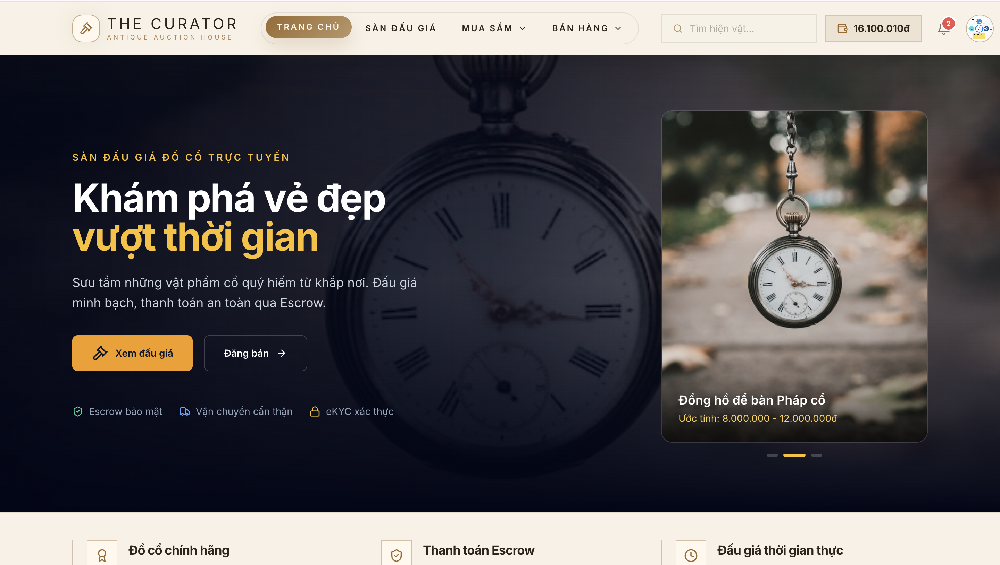
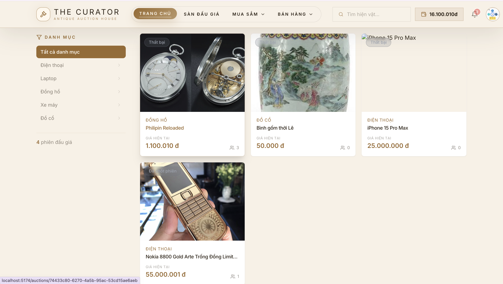
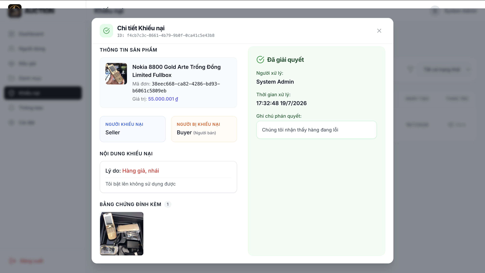
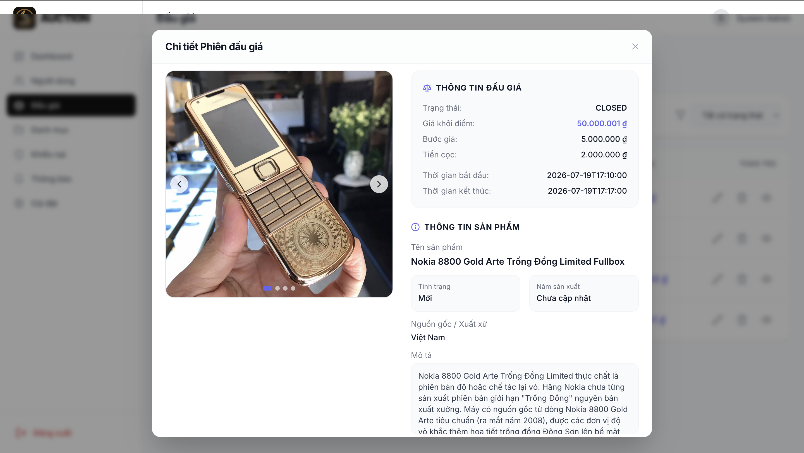
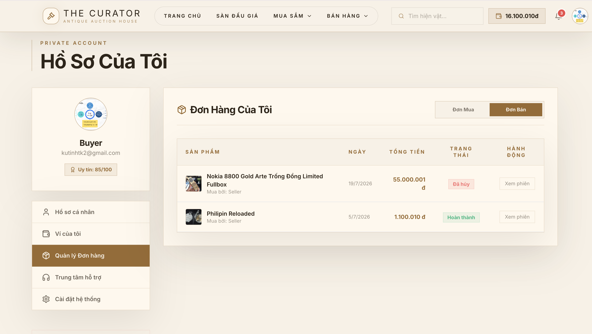
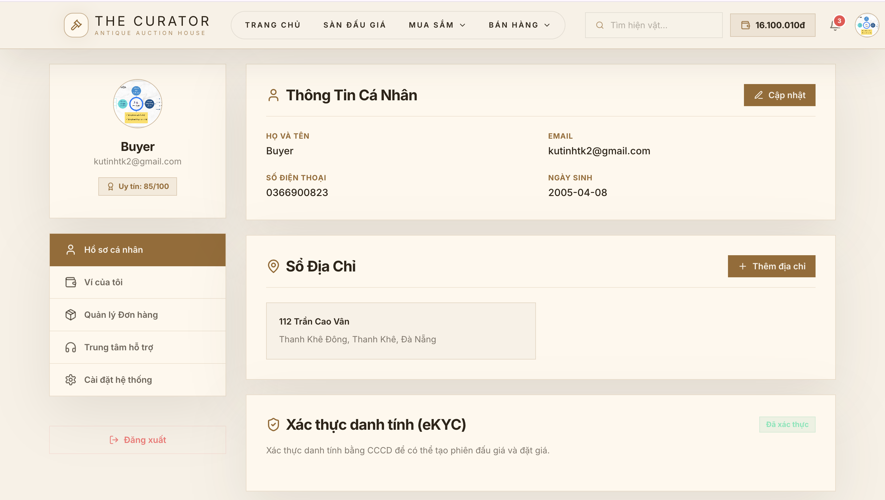
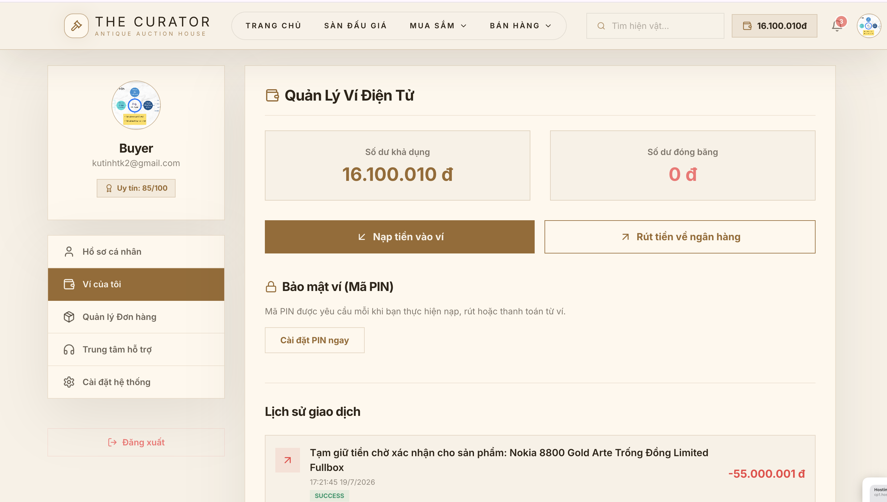
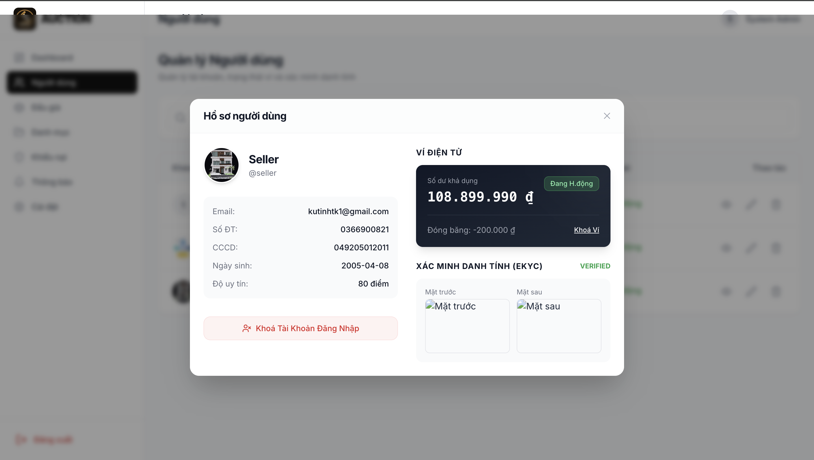
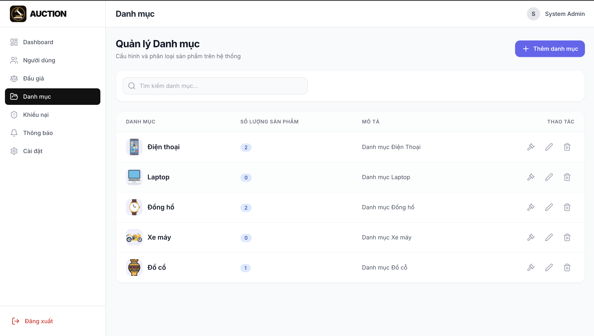

<div align="center">

# 🏷️ Auction Platform — Nền tảng Đấu giá Trực tuyến

Ứng dụng web full-stack cho phép người dùng đăng bán sản phẩm, tham gia đấu giá theo thời gian thực (real-time bid), và quản lý toàn bộ vòng đời giao dịch từ đặt cọc, thanh toán đến nhận hàng.


</div>

---

## 📸 Ảnh minh họa (Demo)

### Giao diện Người dùng
| Trang chủ | Chi tiết đấu giá |
|:---------:|:----------------:|
|  |  |

### Giao diện Quản trị viên
| Bảng điều khiển | Quản lý Đấu giá |
|:---------:|:----------------:|
|  |  |

<details>
<summary><b>🖱️ Xem thêm các hình ảnh khác</b></summary>
<br>

**Người dùng:**
| Đơn hàng | Hồ sơ | Ví điện tử |
|:---------:|:-------------:|:----------:|
|  |  |  |

**Quản trị viên:**
| Người dùng | Danh mục | Khiếu nại |
|:---------:|:-------------:|:----------:|
|  |  |  |

</details>

---

## ✨ Tính năng nổi bật

- **Xác thực đa luồng & eKYC:** Đăng nhập JWT/OAuth2, tự động trích xuất thông tin CCCD qua FPT.AI Vision (OCR).
- **Đấu giá Real-time:** Đặt giá và cập nhật trạng thái ngay lập tức qua WebSocket, cơ chế chống snipe tự gia hạn giờ.
- **Ví điện tử:** Tích hợp ví nội bộ (số dư đóng băng/khả dụng) và cổng thanh toán MoMo/VNPay.
- **Quy trình hoàn chỉnh:** Tự động tạo đơn hàng sau đấu giá, theo dõi trạng thái giao hàng, đánh giá người bán/mua.
- **Quản lý & Khiếu nại:** Cung cấp Dashboard toàn diện cho Admin và hệ thống giải quyết tranh chấp giao dịch minh bạch.

---

## 📂 Cấu trúc dự án

```text
AuctionPlatform/
├── Backend/                            # Spring Boot application
│   ├── src/main/java/.../auctionplatform/
│   │   ├── config/                     # Cấu hình bảo mật, Redis, WebSocket
│   │   ├── controller/                 # Các API endpoints 
│   │   ├── dto/                        # Đối tượng truyền tải dữ liệu (Request/Response)
│   │   ├── entity/                     # Thực thể cơ sở dữ liệu (JPA Models)
│   │   ├── exception/                  # Xử lý ngoại lệ (Exception handler)
│   │   ├── repository/                 # Giao tiếp với Database
│   │   ├── service/                    # Logic nghiệp vụ (Business logic)
│   │   └── utils/                      # Các tiện ích hỗ trợ (Security, Validation)
│   ├── src/main/resources/
│   │   └── application.yaml            # File cấu hình môi trường
│   └── database.sql                    # Script khởi tạo cơ sở dữ liệu
│
└── Frontend/                           # React application (Vite)
    ├── public/                         # Tài nguyên tĩnh (hình ảnh, icon)
    ├── src/
    │   ├── components/                 # Các UI Component dùng chung (Button, Input, Modal...)
    │   ├── features/                   # Tách biệt API và logic theo từng domain (admin, auth, auction...)
    │   ├── layouts/                    # Cấu trúc bố cục trang (AdminLayout, UserLayout)
    │   ├── pages/                      # Các màn hình chính của ứng dụng
    │   ├── routes/                     # Cấu hình điều hướng (React Router)
    │   ├── services/                   # Cấu hình HTTP Client (Axios, interceptors) & WebSocket
    │   ├── store/                      # Quản lý State toàn cục bằng Zustand
    │   └── utils/                      # Tiện ích định dạng tiền tệ, ngày tháng...
    ├── tailwind.config.js              # Cấu hình giao diện TailwindCSS
    └── package.json                    # Danh sách thư viện phụ thuộc
```


---

## 🚀 Hướng dẫn cài đặt (Installation)

**Yêu cầu hệ thống:** Java 21, Node.js 18+, PostgreSQL 14+, Redis 7+.

**1. Clone dự án & Thiết lập Database:**
```bash
git clone https://github.com/Tinh0804/AuctionPlatform.git
cd AuctionPlatform
psql -U postgres -c "CREATE DATABASE auctiondb;"
psql -U postgres -d auctiondb -f Backend/database.sql
```

**2. Cấu hình Backend:**
- Cập nhật các biến môi trường trong `Backend/src/main/resources/application.yaml` (Database, Redis, Cloudinary, FPT.AI, OAuth2).
- Chạy Backend:
```bash
cd Backend
./mvnw clean install -DskipTests
./mvnw spring-boot:run
```

**3. Khởi chạy Redis & Frontend:**
```bash
docker run -d -p 6379:6379 redis:7-alpine

cd Frontend
npm install
echo "VITE_API_URL=http://localhost:8080/AuctionPlatform" > .env
npm run dev
```

---

## 💡 Hướng dẫn sử dụng (Usage)

Sau khi hệ thống khởi chạy thành công:
- **Frontend:** Truy cập `http://localhost:5174`
- **Backend (Swagger API):** Truy cập `http://localhost:8081/AuctionPlatform/swagger-ui.html`

**Tài khoản dùng thử có sẵn:**
| Vai trò | Username | Password |
|---------|----------|----------|
| **Admin** | `admin` | `admin` |
| **Seller** | `seller` | `123456` |
| **Buyer** | `buyer` | `123456` |

Để tạo một phiên đấu giá: Đăng nhập quyền Người bán -> Tới Hồ sơ -> Sản phẩm -> Thêm mới -> Gửi yêu cầu duyệt lên Admin.

---

## 📄 Giấy phép (License)

Dự án này được cấp phép theo tiêu chuẩn **MIT License**. Bạn có quyền sử dụng, sao chép, và chỉnh sửa cho mục đích cá nhân hoặc thương mại.
Mọi chi tiết xin liên hệ hoặc pull request đóng góp cho dự án.