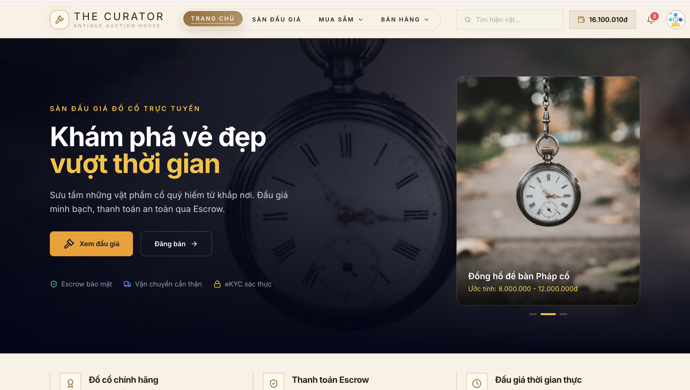
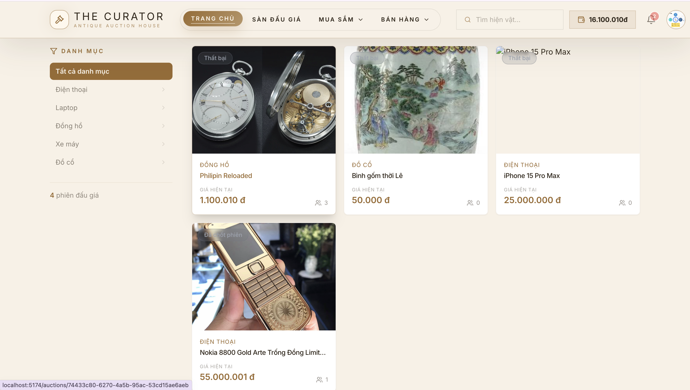
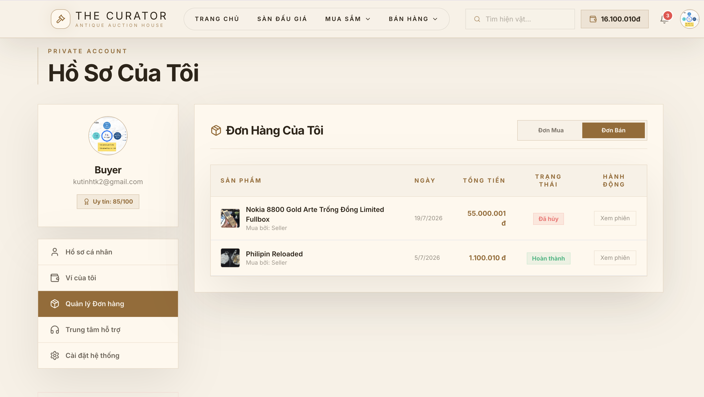
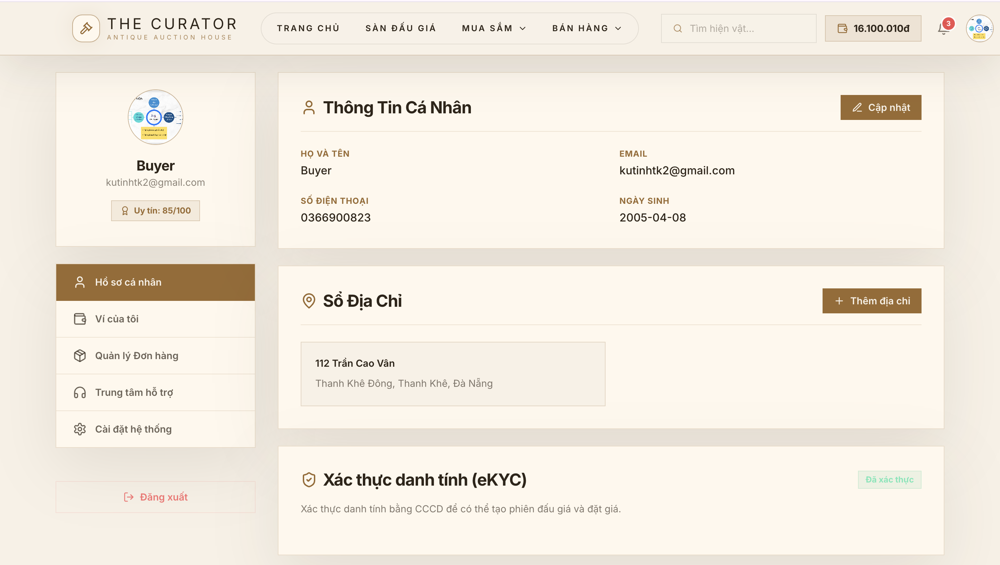
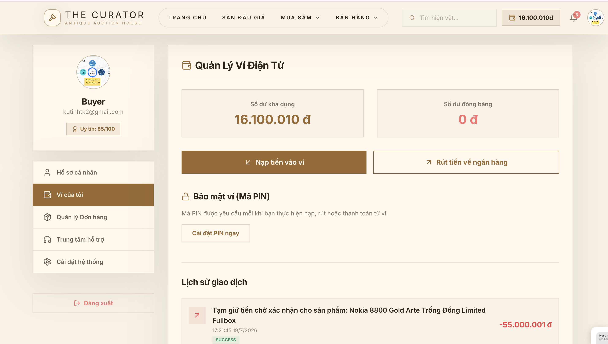
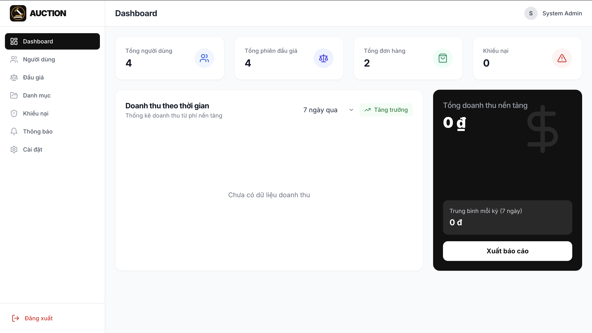
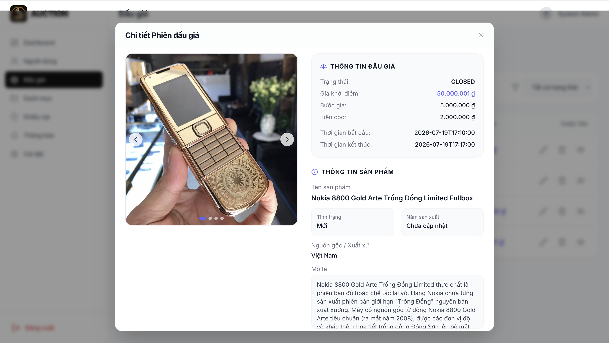
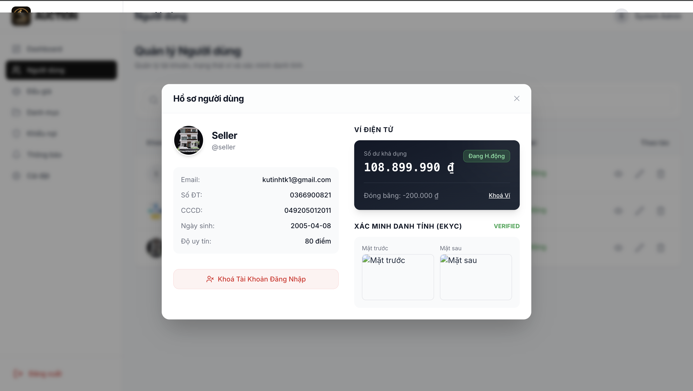
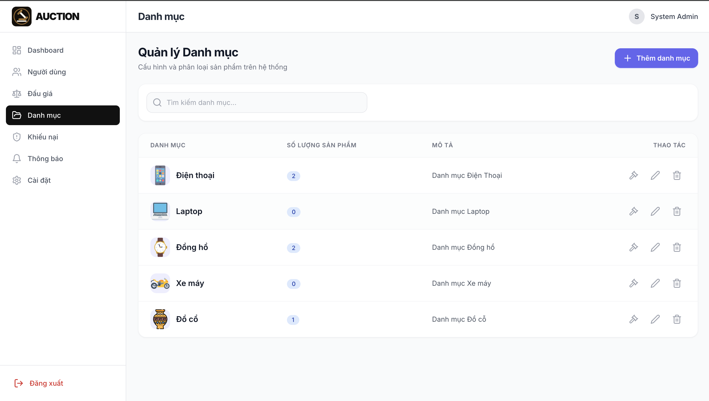
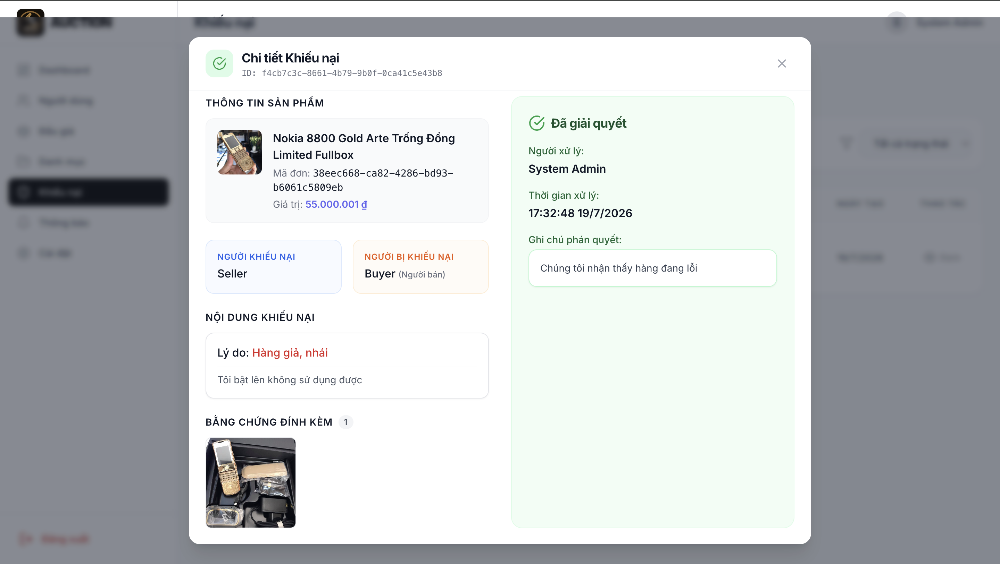

<div align="center">

# 🏷️ Auction Platform — Nền tảng Đấu giá Trực tuyến

**Ứng dụng web full-stack cho phép người dùng đăng bán sản phẩm, tạo phiên đấu giá, đặt giá (bid) theo thời gian thực, và quản lý toàn bộ vòng đời giao dịch từ đặt cọc, thanh toán đến nhận hàng.**

[](https://openjdk.org/)
[](https://spring.io/projects/spring-boot)
[](https://react.dev/)
[](https://tailwindcss.com/)
[](https://www.postgresql.org/)
[](https://redis.io/)
[](https://www.docker.com/)

🔗 **Live Demo:** [https://auctionplatform.tinhlelaptrinh.id.vn](https://auctionplatform.tinhlelaptrinh.id.vn)

</div>

---

## 📸 Ảnh minh họa (Demo)

### Giao diện Người dùng

| Trang chủ | Phiên đấu giá |
| :---: | :---: |
|  |  |

<details>
<summary><b>🖱️ Xem thêm giao diện Người dùng</b></summary>
<br>

| Đơn hàng | Hồ sơ | Ví điện tử |
| :---: | :---: | :---: |
|  |  |  |

</details>

### Giao diện Quản trị viên

| Bảng điều khiển | Quản lý đấu giá |
| :---: | :---: |
|  |  |

<details>
<summary><b>🖱️ Xem thêm giao diện Quản trị viên</b></summary>
<br>

| Người dùng | Danh mục | Khiếu nại |
| :---: | :---: | :---: |
|  |  |  |

</details>

---

## 🔑 Tài khoản Dùng thử (Demo Accounts)

Hệ thống đã chuẩn bị sẵn 3 tài khoản mẫu với đầy đủ dữ liệu và quyền hạn để trải nghiệm toàn bộ luồng nghiệp vụ:

| Vai trò (Role) | Tên đăng nhập (Username) | Mật khẩu (Password) | Quyền hạn & Chức năng chính |
| :--- | :--- | :--- | :--- |
| **👑 Quản trị viên (Admin)** | `admin` | `admin` | Phê duyệt phiên đấu giá, duyệt hồ sơ eKYC, quản lý danh mục, xử lý khiếu nại (Dispute), quản trị hệ thống |
| **💼 Người bán (Seller)** | `seller` | `123456` | Đăng bán sản phẩm, tạo phiên đấu giá, theo dõi diễn biến đặt giá, quản lý đơn hàng hậu đấu giá |
| **🛒 Người mua (Buyer)** | `buyer` | `123456` | Nạp tiền ví, đặt cọc tham gia, đấu giá trực tiếp (Real-time Bid), thanh toán và nhận hàng |

> 💡 *Gợi ý trải nghiệm:* Bạn có thể mở 2 tab trình duyệt (hoặc 1 tab thường + 1 tab ẩn danh) đăng nhập `seller` và `buyer` để xem diễn biến đặt giá real-time qua WebSocket!

---

## 🛠️ Công nghệ (Tech Stack)

### **Backend**
* **Framework:** Java 21, Spring Boot 3.3.0
* **Bảo mật & Xác thực:** Spring Security, OAuth2 (Google/Facebook), JWT (Nimbus JOSE+JWT)
* **Real-time:** Spring WebSocket + STOMP Broker
* **Cơ sở dữ liệu:** PostgreSQL 15 (lưu trữ quan hệ chính), Redis 7 (cache, blacklist token, pub/sub)
* **Tích hợp bên thứ 3:** Cloudinary (lưu trữ ảnh sản phẩm), FPT.AI Vision (OCR nhận diện CCCD eKYC), MoMo & VNPay API
* **Khác:** Spring Data JPA, Hibernate 6, MapStruct, Lombok, SpringDoc OpenAPI (Swagger UI)

### **Frontend**
* **Core:** React 18.2, Vite 4.4.5, TypeScript
* **State Management:** Zustand 5
* **Styling & UI:** TailwindCSS 3, GSAP (animation), Lucide React (icon)
* **Routing:** React Router 6
* **Form & Validation:** React Hook Form + Zod
* **HTTP Client:** Axios Interceptor

### **DevOps & Triển khai**
* **CI/CD:** GitHub Actions (tự động test, build Docker image và deploy lên GCP)
* **Infrastructure:** Google Cloud Platform (Compute Engine VM - Ubuntu 24.04 LTS)
* **Containerization:** Docker & Docker Compose (Layered compose: Infra & App)
* **Web Server & SSL:** Nginx Reverse Proxy + Let's Encrypt SSL (Auto-renewal)

---

## ✨ Điểm nổi bật (Core Features)

* **🔐 Xác thực & Bảo mật Toàn diện:** Đăng nhập nội bộ + Google OAuth2, bảo vệ bằng JWT Access/Refresh Token, cơ chế thu hồi token tức thời qua Redis Blacklist, phân quyền Role (ADMIN, USER).
* **🪪 eKYC — Xác minh danh tính tự động:** Tích hợp FPT.AI Vision OCR tự động trích xuất thông tin CCCD (số CCCD, họ tên, ngày sinh, quê quán), tải ảnh an toàn lên Cloudinary.
* **🏷️ Quản lý phiên đấu giá chuẩn:** Vòng đời phiên đấu giá khép kín (`PENDING → APPROVED → ACTIVE → EXTENDED → CLOSED`). Cơ chế **Anti-Snipe**: Tự động gia hạn thêm thời gian nếu có lượt bid ở những phút cuối.
* **⚡ Đấu giá Thời gian thực (Real-time Bidding):** Đặt giá tức thời qua WebSocket STOMP, cập nhật bảng xếp hạng giá thầu tức thì tới tất cả người xem, bảo đảm tính công bằng và minh bạch.
* **💳 Ví điện tử & Ký quỹ an toàn:** Quản lý số dư khả dụng và số dư đóng băng (ký quỹ khi tham gia đấu giá). Tự động hoàn cọc cho người thua và cấn trừ thanh toán cho người thắng.
* **📦 Quy trình Đơn hàng & Khiếu nại (Dispute):** Tự động khởi tạo đơn hàng khi phiên kết thúc, quản lý trạng thái giao dịch, hệ thống gửi bằng chứng khiếu nại để Admin phân xử công tâm.
* **🔔 Hệ thống Thông báo đa kênh:** Thông báo real-time qua WebSocket khi có lượt đặt giá mới, khi thắng phiên, khi được hoàn tiền cọc hoặc có cập nhật đơn hàng.

---

## 🚀 Hướng dẫn Cài đặt & Chạy thử Local

### Yêu cầu môi trường:
* **Java 21**
* **Node.js 18+** & **npm**
* **Docker & Docker Compose** (hoặc PostgreSQL 15 và Redis 7 cài trực tiếp)

---

### Bước 1: Clone dự án
```bash
git clone https://github.com/Tinh0804/AuctionPlatform.git
cd AuctionPlatform
```

---

### Bước 2: Khởi chạy Hạ tầng (PostgreSQL & Redis)
```bash
# Khởi động PostgreSQL và Redis bằng Docker Compose
docker compose -f deploy/compose.infra.yml up -d
```

---

### Bước 3: Cấu hình và Chạy Backend
1. Kiểm tra cấu hình trong `Backend/src/main/resources/application.yaml` (hoặc tạo file `Backend/.env`).
2. Khởi chạy ứng dụng:
```bash
cd Backend
./mvnw clean spring-boot:run
```
* Backend sẽ chạy tại: `http://localhost:8080/AuctionPlatform`
* Swagger API Docs: `http://localhost:8080/AuctionPlatform/swagger-ui.html`

---

### Bước 4: Cấu hình và Chạy Frontend
```bash
cd ../Frontend
npm install
npm run dev
```
* Mở trình duyệt và truy cập: `http://localhost:5173`

---

## 📄 Giấy phép & Tác giả

Dự án được xây dựng và phát triển cho mục đích **học tập, nghiên cứu và portfolio**.

<div align="center">

*Xây dựng với mong muốn tạo ra một nền tảng đấu giá trực tuyến minh bạch, bảo mật và trải nghiệm real-time mượt mà!* ⭐

</div>
